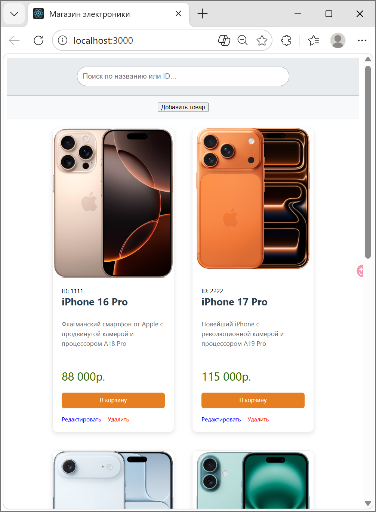
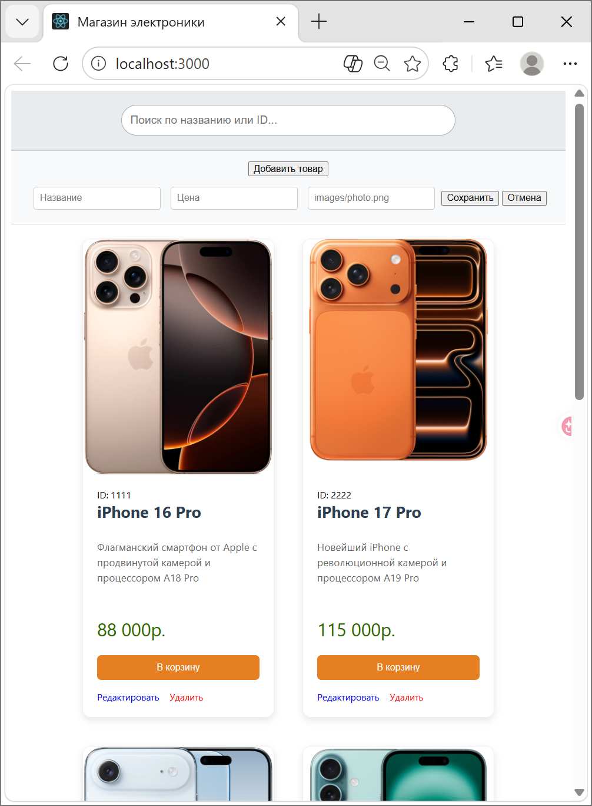

# 🛒 Магазин электроники

Минималистичный интернет-магазин на **Express.js** с возможностью управления товарами (CRUD) и живым поиском.

## ✨ Особенности проекта
- **Frontend**: HTML, JavaScript, стилизация с использованием **SASS (SCSS)**.
- **Backend**: Сервер на **Node.js + Express**.
- **Функционал**: 
  - Просмотр списка товаров в виде сетки.
  - Поиск по названию или ID в реальном времени.
  - Добавление новых товаров через форму.
  - Редактирование и удаление существующих товаров через API.

## 📂 Структура папок
- `public/` — статическая часть проекта (HTML, CSS, картинки).
- `public/styles/main.scss` — исходные стили (Sass).
- `app.js` — главный файл сервера Express.
- `package.json` — зависимости и скрипты проекта.

## 🚀 Как запустить

1. **Установите зависимости:**
   ```bash
   npm install

### Вид сайта:




### Практики 4-5 сделаны на репозитории https://github.com/0Alexandr/PR4-5_front2